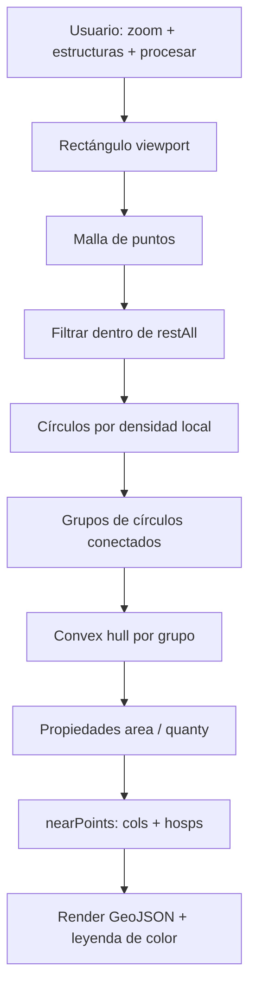

# Vortic

**Prototipo web** para la **planificación y evaluación de viviendas de emergencia** sobre el mapa: delimita **zonas disponibles**, estima **cuántas estructuras** serían viables por área y muestra la **calidad relativa del entorno** según la cercanía a **colegios** y **centros de salud**. La lógica actual está pensada para evolucionar hacia **modelos territoriales más complejos** en el futuro.

El resto de este documento es el **análisis técnico del proyecto** (objetivo, stack, estructura, flujo, datos, hooks y operaciones espaciales).

---

## 1. Objetivo del proyecto

### 1.1 Propósito

El objetivo de **Vortic** es apoyar la **planificación y la evaluación de viviendas de emergencia** sobre el territorio. La idea es combinar **criterios geográficos** (dónde hay espacio físicamente disponible) con **criterios de entorno** (qué tan cerca quedan servicios esenciales como **centros de salud** y **colegios**) para priorizar **áreas candidatas** antes de desplegar un modelo más elaborado.

### 1.2 Qué hace hoy el prototipo en el mapa

En esta versión, la aplicación ejecuta **cálculos basados en el mapa** para:

1. **Delimitar zonas disponibles** — polígonos generados a partir del área visible en pantalla y de la capa base de territorio apto (`restAll`).
2. **Estimar cuántas estructuras podrían ser viables** en cada zona — mediante una heurística simple (relación entre **área** del polígono y un **factor fijo**; en la UI se muestra como “estructuras viables”).
3. **Interpretar la “calidad” del área** en función de la **cercanía** a puntos de referencia: se usa una métrica derivada de las distancias al colegio y al centro de salud más cercanos (listas de coordenadas en el código), que se refleja en el **color** de cada zona (verde = mejor posición relativa, rojo = peor).

No sustituye estudios de suelo, normativa ni ingeniería; **orienta conversaciones** sobre emplazamiento y priorización visual.

### 1.3 Alcance: prototipo y evolución

Este repositorio es un **prototipo**: la lógica está acotada y simplificada para demostrar el flujo en un mapa interactivo. A futuro, la misma línea de razonamiento podría **alimentar un modelo más complejo** (reglas urbanas, capacidad por módulo, redes, costos, restricciones legales, optimización multiobjetivo, etc.) reutilizando la noción de *zonas candidatas + indicadores de entorno*.

### 1.4 Interfaz actual

- Barra superior **VORTIC**, búsqueda de direcciones (Mapbox) y pie con referencias **CORFO** / programa de apoyo.
- Mapa **Leaflet** con capas GeoJSON (territorio base, colegios, hospitales).
- Panel lateral: capas, **cantidad de estructuras** (entrada del usuario), **procesar** y **limpiar**.

Versión en pantalla: **v1.0.0-beta.1** (`MapComponent.jsx`, `index.html`).

---

## 2. Stack tecnológico

| Capa | Tecnología |
|------|------------|
| Runtime UI | **React 18** |
| Bundler / dev server | **Vite 5** + **@vitejs/plugin-react-swc** |
| Mapa | **Leaflet** + **react-leaflet** |
| Componentes UI | **Material UI (MUI) v5** + Emotion |
| Geometría / análisis espacial | **Turf.js** (`@turf/turf`) |
| Puntos / teselación (hook `useMaps`) | **d3** (p. ej. Delaunay / Voronoi) |
| Calor en mapa (dependencia presente) | **leaflet.heat** |
| Búsqueda de lugares | **API Geocoding de Mapbox** (HTTP `fetch`) |

También figuran en `package.json` dependencias usadas sobre todo por **componentes de ejemplo o rutas no montadas** en `App` actual (`react-map-gl`, `mapbox-gl`, `leaflet-heatmap`, etc.): conviene tratarlas como **candidatas a limpieza** si no se usan en build final.

---

## 3. Estructura relevante del código

```
src/
  App.jsx                    # Punto de entrada visual (monta MapComponent)
  main.jsx                   # createRoot + StrictMode
  components/
    MapComponent.jsx         # Pantalla principal: mapa, análisis, GeoJSON
    MapWithHeatLayer.jsx     # Ejemplo Leaflet + heat (importado en MapComponent, no usado en el JSX principal)
    MapWithBuildings.jsx     # Ejemplo Mapbox GL (importado en App pero no renderizado en el return actual)
  hooks/
    useMaps.js               # Datos sintéticos + utilidades (Voronoi, grillas, círculos) + array enorme `builds`
    useOperations.js         # Expone operaciones espaciales modulares + alias en español para MapComponent
    useMapBox.js             # Geocoding Mapbox (token en código)
    operations/              # Implementación en inglés de operaciones Turf/GeoJSON
      index.js               # Objeto `spatialOperations` (API pública agregada)
      *.js                   # Módulos por tema (booleanas, grillas, hull, etc.)
public/
  restAll.json               # Multipolígono base del “mapa Vortic” (área de trabajo)
  colegios.json, hospitales.json
  LOGO.png, corfo.png, gob.jpeg, …
```

---

## 4. Flujo de la aplicación (usuario)

1. El usuario ve el mapa centrado en coordenadas por defecto (~Valparaíso).
2. Puede **buscar** una dirección: el texto dispara `useMapBox().searchPlaces` → resultados en `Autocomplete` → al elegir, se actualiza el centro del mapa.
3. Activa/desactiva capas: **mapa base Vortic** (`restAll`), **colegios**, **hospitales**.
4. Introduce **número de estructuras** (validación: debe ser mayor que 0 para procesar).
5. Pulsa **procesar** (`btn` en `MapComponent.jsx`):
   - Exige **zoom ≥ 18** (mensaje de error si no).
   - Construye un **rectángulo** con el viewport actual (`generarRectanguloGeoJSON`).
   - Genera una **malla de puntos** dentro de ese rectángulo (`generarMallaDePuntos`).
   - Filtra puntos **dentro** del multipolígono `restAll` (`puntosDentroDeMultipoligono`).
   - Agrupa puntos en **círculos** (`nearGroup` / `insideCircle`).
   - Agrupa círculos **conectados** por proximidad y solape (`encontrarGrupoIntersectado`).
   - Por cada grupo obtiene un **envolvente** tipo casco convexo sobre la unión (`obtenerLineasExteriores`).
6. Cada zona resultante recibe `properties.area`, `properties.quanty` (⌊área/250⌋) y luego `distanceProm` vía `nearPoints` (distancia promedio a colegio + hospital más cercanos según listas `cols` / `hosps`), como **proxy de calidad del entorno** para vivienda de emergencia.
7. Las zonas se dibujan con **estilo por rangos** según `distanceProm` (`geoJsonStyle07`): el color comunica de un vistazo si el área es relativamente **favorable** (cerca de salud y educación) o **menos favorable**.
8. **limpiar** vacía la colección de zonas.



---

## 5. Datos y capas GeoJSON

- **`restAll`**: multipolígono que representa el **territorio donde el prototipo considera viable** plantear emplazamientos; acota el análisis dentro del rectángulo de pantalla.
- **`colegios` / `hospitales`**: capas de puntos con marcadores personalizados.
- **Listas hardcodeadas `cols` y `hosps`**: coordenadas usadas solo en el paso de **métrica de proximidad** (`nearPoints`), no como capa GeoJSON propia.

Los JSON/imágenes se importan desde `public/` en `MapComponent.jsx`. En **Vite 5** esto puede generar advertencias o errores según configuración: valorar mover datos grandes a `src/` o cargar por `fetch` desde URLs públicas (`/archivo.json`).

---

## 6. Hooks y responsabilidades

### `useMapBox.js`

- Expone `searchPlaces(query)`.
- Llama a `https://api.mapbox.com/geocoding/v5/mapbox.places/...` con **token de acceso embebido**.
- **Riesgo de seguridad y coste**: el token es visible en el cliente; en producción debe ir en **variables de entorno** (`import.meta.env`) y con restricciones de URL en la cuenta Mapbox.

### `useMaps.js`

- Genera **`data01`**: colección de ~200 puntos aleatorios alrededor de Valparaíso con propiedad `value`.
- Funciones de apoyo: **Voronoi** (`generateVoronoiPolygons`), **círculos** alrededor de puntos, **rejillas** (`generateGrid`, `generateGrid2` con colores por promedio).
- **`getBuilds()`** devuelve un array masivo **`builds`** (cientos de miles de líneas de GeoJSON embebido en el mismo archivo).
- En el `MapComponent` actual, el resultado de `useMaps()` se **desestructura** pero **no se observa uso** en el flujo principal del análisis de emplazamientos: queda como **API / datos reservados** o código legacy.

### `useOperations.js` + `operations/`

`useOperations()` devuelve un **único objeto** (memoizado con `useMemo`) que combina:

1. **`spatialOperations`** — API en **inglés**: funciones puras sobre GeoJSON / Turf (`operations/index.js` y submódulos).
2. **`legacySpanishApi`** — los **mismos punteros a función** con nombres **en español**, para compatibilidad con `MapComponent.jsx`.

En el flujo **procesar** (`btn()`), el análisis principal usa sobre todo **helpers locales** en `MapComponent.jsx`; `operations/` es una **biblioteca** para restas, recortes, muestreo y geometría auxiliar cuando se integre más lógica de vivienda de emergencia.

---

#### 6.3.0 Evaluación global (calidad / robustez)

| Criterio | Valoración | Detalle |
|----------|------------|---------|
| **Corrección con datos válidos** | Alta | Se apoya en **Turf** (`difference`, `intersection`, `convex`, `buffer`, `booleanPointInPolygon`, …), comportamiento estándar en el plano de coordenadas del GeoJSON. |
| **Robustez ante datos reales** | Media-baja | Muchas rutas usan **`features[0]`** sin comprobar `geometry.type` antes de `turf.polygon(...)` / `turf.multiPolygon(...)`: tipos inesperados pueden **lanzar** o devolver `null` sin mensaje explícito. |
| **Rendimiento** | Variable | `generateInteriorPointGrid` recorre **todo el bbox** con paso fijo → coste ~**O((Δx/step)·(Δy/step))**; pasos muy pequeños pueden **congelar** el navegador. |
| **Modelo geográfico** | Planificado, no geodésico | Chaikin, espiral y cuarto de círculo usan **trigonometría en [lng, lat]**; no sustituyen cálculo en metros sobre el elipsoide salvo que se proyecte antes. |
| **Cobertura geométrica** | Parcial | `computeConvexHullFromPolygonCollection` solo usa **anillos exteriores** (`coordinates[0]` / primer anillo de cada parte de un `MultiPolygon`); ignora huecos y geometrías que no sean `Polygon` / `MultiPolygon`. |

**Interno (no exportado en `spatialOperations`):** `filterPolygonFeaturesWithRing` solo comprueba `coordinates[0].length >= 4`; **no** exige `type === "Polygon"`. Para colecciones mixtas es más seguro **`filterValidPolygonFeatures`**.

---

#### 6.3.1 Constantes (`constants.js`)

##### `DEFAULT_INTERIOR_GRID_STEP` (≈ `0.0003`)

- **Qué representa:** incremento en **grados decimales** (longitud y latitud) entre puntos de prueba en la malla interior.
- **Efecto práctico:** a latitudes chilenas, del orden de **decenas de metros** por paso de forma aproximada; **no** es un tamaño de celda constante en metros al suelo.
- **Ajuste:** valores más pequeños → malla más densa y más costosa; más grandes → muestreo más grueso.

##### `DEFAULT_CHAIKIN_ITERATIONS` (`5`)

- **Qué representa:** número de **pasadas** del esquema de Chaikin sobre el anillo exterior del polígono.
- **Efecto:** cada pasada **multiplica** aproximadamente la cantidad de vértices; muchas iteraciones pueden generar geometrías muy densas o **auto-intersecciones** en polígonos muy cóncavos.

---

#### 6.3.2 Fichas detalladas por función (API en inglés)

##### `runConvexHullSampleDemo(legacyInput?)` — `polygonHull.js`

- **Entrada:** cualquier valor; **se ignora**.
- **Proceso:** crea puntos fijos en Italia, calcula `turf.convex`, opcionalmente `console.debug`.
- **Salida:** `undefined` (no devuelve geometría al llamador).
- **Valoración:** **solo legado / demo**; no sustituye análisis sobre datos del usuario.

##### `computeConvexHullFromPolygonCollection(collection)` — `polygonHull.js`

- **Entrada:** `FeatureCollection`.
- **Proceso:** por cada feature, si es `Polygon` recorre **todos** los vértices de `coordinates[0]`; si es `MultiPolygon`, por cada parte toma el anillo `polygon[0]`. Acumula `turf.point` por vértice y aplica `turf.convex`.
- **Salida:** `Feature` `Polygon` o `null` si hay menos de 3 puntos.
- **Omisiones:** no indexa `Point`/`LineString`; ignora **huecos** y anillos interiores.
- **Valoración:** **correcta** para “envolvente convexa de todos los vértices exteriores” del conjunto dado.

##### `convexHullAroundPolygonCentroids(polygonFeatures)` — `polygonHull.js`

- **Entrada:** **array** de `Feature` con geometría `Polygon`.
- **Proceso:** `turf.centroid` por polígono → `turf.convex` sobre esos puntos.
- **Salida:** `Feature` o `null` (array vacío); con 1–2 puntos el resultado depende de Turf (puede ser `null` o degenerado).
- **Valoración:** **adecuada** para resumir un conjunto de polígonos como **nube de centroides**; no representa el área unión de los polígonos originales.

##### `subtractPolygonsFromMask(mask, obstacles)` — `polygonBoolean.js`

- **Entrada:** dos `FeatureCollection`. Usa **solo** `mask.features[0]` como `Polygon`.
- **Proceso:** obstáculos filtrados con `filterPolygonFeaturesWithRing` → `MultiPolygon` → `turf.difference(maskPolygon, obstaclesMulti)`. Sin obstáculos válidos devuelve la máscara sin diferenciar.
- **Salida:** `Feature` o `null` si la diferencia es vacía.
- **Riesgos:** `mask.features[0]` debe ser `Polygon` válido; geometrías inválidas o topología frágil pueden hacer fallar Turf.
- **Valoración:** **correcta** en el caso de uso “una máscara menos muchos obstáculos poligonales”.

##### `subtractResidentialFromBase(baseArea, residentialPolygons)` — `polygonBoolean.js`

- **Comportamiento:** idéntico a `subtractPolygonsFromMask`.
- **Valoración:** alias transparente; misma evaluación.

##### `subtractBasePolygonFromRestMultiPolygon(base, rest)` — `polygonBoolean.js`

- **Proceso:** `turf.difference(restMulti, basePolygon)` con `rest.features[0]` como **`MultiPolygon`** y `base.features[0]` como **`Polygon`**.
- **Salida:** `Feature` o `null`.
- **Riesgos:** si `rest.features[0]` es `Polygon` simple, `turf.multiPolygon(...)` puede **fallar** o interpretar mal la jerarquía de coordenadas.
- **Valoración:** **útil** cuando el contrato de datos es estricto (rest = multipolígono).

##### `subtractPathPolygonsFromBase(baseMask, paths)` — `polygonBoolean.js`

- **Proceso:** primera feature de `baseMask` (como `Feature` completa) menos `MultiPolygon` construido desde `paths`. Si no hay paths válidos, devuelve la base intacta.
- **Valoración:** encaja en “suelo menos corredores”; validar que la primera feature sea compatible con `turf.difference`.

##### `subtractBuildingsFromResidentialWays(ways, buildings)` — `polygonBoolean.js`

- **Entrada:** `ways` = `FeatureCollection` (primer feature = `MultiPolygon`); `buildings` = **array** de `Feature` (no `FeatureCollection`).
- **Valoración:** **coherente** si el tipo de datos se respeta; error frecuente: pasar `buildings` como colección envuelta.

##### `subtractMultiPolygonFromSubtractionMask(base, subs)` — `polygonBoolean.js`

- **Proceso:** todas las features poligonales válidas de `base` → un `MultiPolygon`; se resta **solo** el primer polígono de `subs.features[0]`. Si no hay base válida → `null`.
- **Valoración:** operación **acotada** a una máscara de sustracción; no procesa toda la colección `subs`.

##### `clipMultiPolygonToBounds(basePolygons, bounds)` — `polygonBoolean.js`

- **Proceso:** `turf.intersection(multiPolygonDeBase, turf.polygon(bounds.geometry.coordinates))`.
- **Salida:** porción del territorio base **dentro** del polígono de recorte (p. ej. rectángulo de trabajo).
- **Riesgos:** intersección vacía → `null` según Turf.
- **Valoración:** **correcta** para recorte booleano estándar.

##### `generateInteriorPointGrid(mask, stepDegrees?)` — `polygonGrid.js`

- **Proceso:** bbox del **primer** polígono de `mask`; doble bucle en lng/lat; conserva puntos con `booleanPointInPolygon` respecto a ese polígono.
- **Complejidad:** producto de divisiones del ancho y alto del bbox por `stepDegrees`.
- **Valoración:** **correcta** para muestreo; parametrizar `stepDegrees` o acotar bbox en escenarios grandes.

##### `bufferPathLinesToPolygons(pathLines, bufferMeters)` — `pathBuffers.js`

- **Proceso:** por cada feature de `pathLines`, `turf.buffer(..., { units: "meters" })`.
- **Salida:** un polígono buffer **por** feature; **no** hace `union` global.
- **Valoración:** **correcta** como paso intermedio; fusionar solapes es responsabilidad del caller.

##### `smoothPolygonChaikin(polygon, iterations?)` / `smoothPolygonChaikinAsTurfPolygon(...)` — `polygonSmoothing.js`

- **Proceso:** Chaikin sobre `coordinates[0]`; la variante `AsTurfPolygon` envuelve el resultado en `turf.polygon`.
- **Riesgos:** muchas iteraciones → muchos vértices y posible **auto-intersección** en formas muy cóncavas.
- **Valoración:** **buena** para suavizado visual; validar geometría si luego entra en operaciones booleanas.

##### `createEmptyFeatureCollection` / `createMultiPointFeature` / `createPointFeature` — `geojsonBuilders.js`

- **Comportamiento:** construyen objetos GeoJSON mínimos sin Turf.
- **Valoración:** **trivial y correctas**; sin validación de rangos lng/lat.

##### `toTurfPoint(point)` — `geojsonCollectionUtils.js`

- **Comportamiento:** valida par numérico `[lng, lat]` o **lanza** `Error`.
- **Valoración:** **buen guardia** en el borde del sistema.

##### `flattenPolygonRingCoordinates(geojson)` — `geojsonCollectionUtils.js`

- **Comportamiento:** asume `geometry.coordinates[0]` por elemento del arreglo de entrada.
- **Valoración:** **frágil** si el input no es una lista homogénea de polígonos con esa forma.

##### `getFeatureCollectionFeatures(geojson)` — `geojsonCollectionUtils.js`

- **Comportamiento:** devuelve **referencia** a `geojson.features` (no clona).
- **Valoración:** correcta pero **mutable** por alias.

##### `removeDuplicateCoordinateFeatures(geoJSONCollection)` — `geojsonCollectionUtils.js`

- **Comportamiento:** deduplicación por `JSON.stringify(geometry.coordinates)` completo.
- **Riesgos:** coste de CPU/memoria en geometrías **muy grandes**.
- **Valoración:** **correcta** para igualdad exacta de geometría serializada.

##### `filterValidPolygonFeatures(collection)` — `polygonValidation.js`

- **Comportamiento:** solo `Polygon` con `coordinates[0].length >= 4`.
- **Valoración:** **más segura** que `filterPolygonFeaturesWithRing` para FC mixtas.

##### `southeastQuarterCirclePointFeatures(center, radius, segmentCount)` — `spiralGeometry.js`

- **Comportamiento:** arco en plano lng/lat; duplica el primer punto al final; devuelve array de `Feature` `Point`.
- **Riesgos:** `segmentCount === 0` → **división por cero** en `(i / segmentCount)`; evitar.
- **Valoración:** útil para **prototipos** de patrones radiales; no es arco geodésico.

##### `generateSpiralCoordinates(...)` — `spiralGeometry.js`

- **Comportamiento:** espiral en plano; tras cada punto, `radius += radiusGrowth`.
- **Valoración:** coherente para exploración visual; mismas salvedades geodésicas.

---

#### 6.3.3 Alias en español (referencia rápida)

| Alias (legado) | Función en inglés |
|----------------|-------------------|
| `calculateConvexHullFromGeoJSON` | `runConvexHullSampleDemo` |
| `generarPoligonoRodeador` | `convexHullAroundPolygonCentroids` |
| `restarPoligonos` | `subtractPolygonsFromMask` |
| `generarCuadricula` | `generateInteriorPointGrid` |
| `restarPoligonos02` | `subtractResidentialFromBase` |
| `restarPoligonosSimples` | `subtractBasePolygonFromRestMultiPolygon` |
| `crearPoligonosDesdeLineasDeCaminos` | `bufferPathLinesToPolygons` |
| `restarCaminos` | `subtractPathPolygonsFromBase` |
| `restarBuildsToResiWay` | `subtractBuildingsFromResidentialWays` |
| `polygonsSubstrac` | `subtractMultiPolygonFromSubtractionMask` |
| `geoJsonBase` | `createEmptyFeatureCollection` |
| `workArea` | `clipMultiPolygonToBounds` |
| `crearCuartoCirculoSureste` | `southeastQuarterCirclePointFeatures` |
| `crearEspiral` | `generateSpiralCoordinates` |
| `pointGeoJson` | `createMultiPointFeature` |

---

#### 6.3.4 Archivos del directorio `operations/`

| Archivo | Rol |
|---------|-----|
| `index.js` | Agrega y exporta `spatialOperations`. |
| `constants.js` | Constantes numéricas compartidas. |
| `polygonHull.js` | Casco convexo (demo, por colección, por centroides). |
| `polygonBoolean.js` | Diferencias e intersección con Turf. |
| `polygonGrid.js` | Malla de puntos interiores. |
| `pathBuffers.js` | Buffer de líneas a polígonos. |
| `polygonSmoothing.js` | Suavizado Chaikin. |
| `polygonValidation.js` | Filtros de polígonos válidos (`filterValidPolygonFeatures` y `filterPolygonFeaturesWithRing`, esta última solo para uso interno de `polygonBoolean.js`). |
| `geojsonBuilders.js` | Construcción de features / colecciones vacías. |
| `geojsonCollectionUtils.js` | Conversión, deduplicación, extracción de features. |
| `spiralGeometry.js` | Arco y espiral en coordenadas mapa. |

---

## 7. Cómo ejecutarlo

El proyecto está **desplegado en producción** en Vercel: **[https://vortic01.vercel.app/](https://vortic01.vercel.app/)** (misma línea que la interfaz **v1.0.0-beta.1** descrita más arriba).

Para clonar el repositorio y trabajar en local:

| Comando | Descripción |
|--------|-------------|
| `npm install` | Instala dependencias |
| `npm run dev` | Servidor de desarrollo (Vite) |
| `npm run build` | Build de producción → `dist/` |
| `npm run preview` | Vista previa del build |
| `npm run lint` | ESLint |

---

## 8. Resumen en una frase

**Vortic** es un **prototipo** (React + Vite + Leaflet) para **planificar y evaluar emplazamientos de vivienda de emergencia** en torno a Valparaíso: a partir del mapa **delimita zonas disponibles**, **estima cuántas estructuras** cabrían por zona y **clasifica el área** según la proximidad a **colegios y centros de salud**, como base para, más adelante, conectar la misma lógica a **modelos territoriales más completos**.

---

*Actualizar este README si cambia el flujo de negocio o la arquitectura.*
